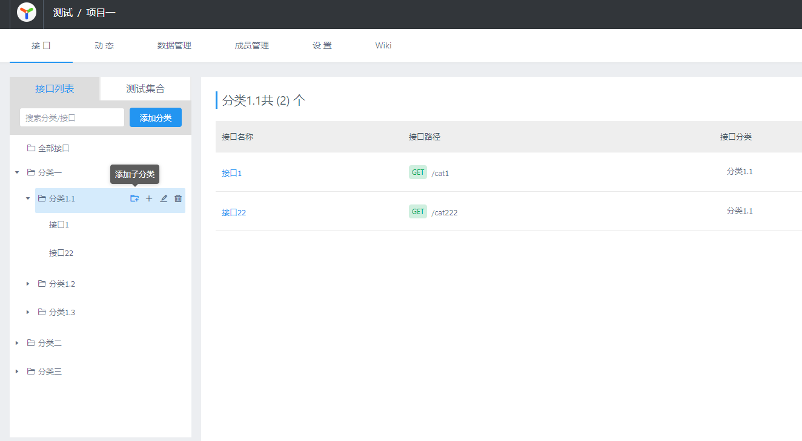

## YApi  可视化接口管理平台 （多级目录分支）

> 参考图片 

  

<br/>

---

<br/>

### 分支介绍 
  * fork 官方 **api v1.10.2**
  - 主要支持`多级目录`,`添加子目录`
  - 支持不同层级`目录拖拽`
  - 支持多级`目录搜索`

---
### 二次开发
#### 前置
- nodejs
- mongoDB

#### 步骤
1. 创建文件夹 `vendors`
2. 进入 `vendors` 文件夹，
3. 克隆本项目到 `vendors` 文件夹，命名为 `yapi`
  * `git clone --branch master --depth 1 http://git.szistech.com/devops/yapi.git .`
3. 复制 `yapi/config_example.json` 为 `./config.json`
4. 进入 `yapi` 目录
  * 执行 `yarn` 或 `npm install` 命令
  * 执行 `yarn install-server` 初始化数据库，**此步骤可在有数据库的时候跳过**
  * 开2个命令行窗口/session，分别执行命令 `yarn dev-server` 和 `yarn dev-client` 分别运行 server 和 client
5. 修改代码实时查看

---
### 内网部署
  - 需要事先安装 nodejs，mongodb  
  - 这里采用不同安装，部署的方式，大体上步骤和官方一样 

> config.json里面的内容，具体看官方

```shell
#复制完成后请修改相关配置
cp vendors/config_example.json ./config.json 
# 指令打开config，或者用鼠标打开
vi ./config.json 
#再进入vendors
cd vendors
npm install --production --registry https://registry.npm.taobao.org
#安装程序会初始化数据库，管理员账号名可在 config.json 配置
npm run install-server 
#启动服务器后，#请访问 127.0.0.1:{config.json配置的端口}
node server/app.js 
# linux 后台模式 注意 nohup 与 & exit
nohup  node server/app.js exit    
  ``` 
### Docker镜像打包
查看 **Docker** 目录 `README.md` 文件
在 `docker` 目录 执行命令 `docker build .` 或者 `docker build -t yapi:1.10.2 .`

---
 **常见问题**

 - 1. 依赖报错
 一般依赖报错是由于 yapi的很多依赖库版本有点旧 ，需要手动锁定版本

 - 2. node-sass node-gyp  安装不上 
   可能是node-gyp没安装  

   建议node14,高版本和node-sass的版本匹配
   ```shell
    npm install -g node-gyp
    npm rebuild node-gyp
   ```
 
 - 3. 没有ykit指令    
   npm install -g ykit

---
